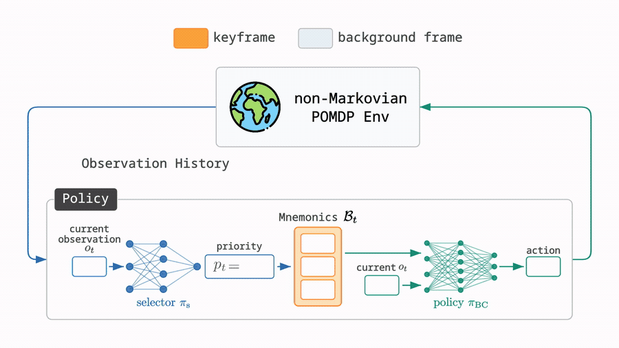
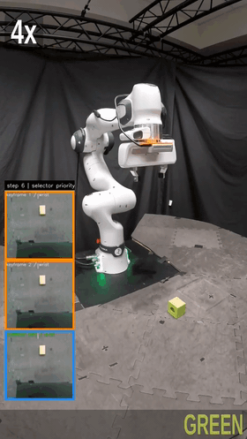
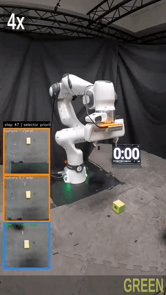
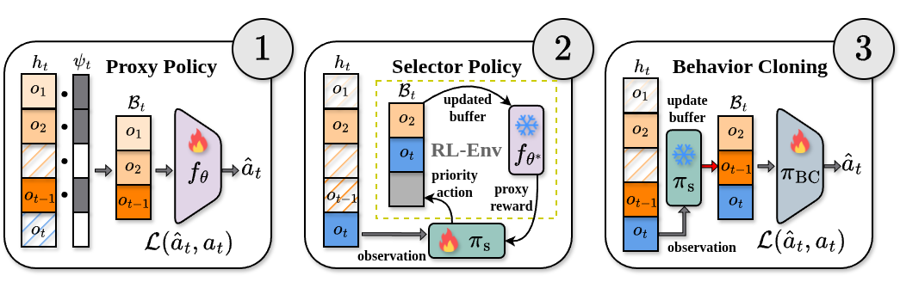

# Self-Supervised Keyframe Discovery for Horizon-Invariant Behavior Cloning


 <br>
<p align="center">
  <a href="https://keyframe-mnemonics.github.io">[Project page]</a> •
  <a href="https://keyframe-mnemonics.github.io">[Paper (coming soon)]</a>
</p>
<p align="center">
  <a href="https://prabinrath.github.io/">Prabin Kumar Rath</a><sup>1</sup>,
  <a href="https://omkarpatil18.github.io/">Omkar Patil</a><sup>1</sup>,
  <a href="https://nakulgopalan.github.io/">Nakul Gopalan</a><sup>1</sup> <br>
  <sup>1</sup>Arizona State University
</p>
In memory-intensive imitation, the observation that determines the action is often long gone by the time the action is taken. Instead of widening context windows or repeatedly compressing a hidden state, Keyframe Mnemonics (KM) turns memory into a sparse <i>selection</i> problem: a selector network learns which observations are decision-critical, keeps them in a fixed-size mnemonic buffer, and a behavior cloning policy acts from that buffer plus the current observation. Because the buffer size does not grow with the episode, the learned behavior is horizon-invariant, i.e. it generalizes to cue-to-decision delays far longer than anything seen during training. KM does not require any explicit keyframe annotation and is fully self-supervised. This repository contains the training pipeline, data generation, and evaluation scripts for KM across synthetic, grid, robot manipulation, and real-world domains. <br><br>

<div align="center">
  
</div> <br>

## Table of Contents
- 🦾 [Real-world rollouts](#-real-world-rollouts)
- 🧰 [Installation](#-installation)
- 📦 [Data generation](#-data-generation)
- ⚙️ [Training](#%EF%B8%8F-training)
- 📊 [Evaluation](#-evaluation)
- 🧭 [Domains](#-domains)
- 📜 [License](#-license)
- 🙏 [Acknowledgement](#-acknowledgement)
- 📝 [Citation](#-citation)

## 🦾 Real-world rollouts
The robot is shown a red or green cube for 3–5s. The cue is then removed, and after a delay two cubes appear 30 cm apart — the robot must reach for the color it was shown. Demonstrations were collected at a ~5s cue-to-choice delay; the policy is evaluated at delays **20× longer** with frozen parameters. Videos play at 4×; the panel on the left shows the mnemonic buffer (orange) and the current observation (blue).

<table align="center">
<tr>
<th align="center" width="50%">&Delta;t = 3&ndash;5s &nbsp;·&nbsp; training horizon</th>
<th align="center" width="50%">&Delta;t = 100&ndash;120s &nbsp;·&nbsp; 20&times; out-of-distribution</th>
</tr>
<tr>
<td align="center"></td>
<td align="center"></td>
</tr>
<tr>
<td align="center"><b>20 / 20</b> success</td>
<td align="center"><b>16 / 20</b> success</td>
</tr>
</table>

> **NOTE:** The real-robot domain lives on the [`lerobot`](https://github.com/prabinrath/keyframe-mnemonics/tree/lerobot) branch, and the on-hardware deployment code in our [LeRobot fork](https://github.com/prabinrath/lerobot/tree/keyframe_mnemonics).

## 🧰 Installation
Tested on Ubuntu 22.04 with an NVIDIA RTX 3090. Install a CUDA build of PyTorch first.
```bash
pip install torch==2.7.1 torchvision==0.22.1 --index-url https://download.pytorch.org/whl/cu126
```
> Base install — synthetic domains (`tmaze`, `add`, `scattered_copy`)
```bash
pip install -e .
```
> Extras — grid and robot domains, both installable in the same env
```bash
pip install -e ".[grid]"     # minigrid, imageio, LTMB
pip install -e ".[mikasa]"   # mani_skill, lerobot, diffusers, rerun-sdk, mikasa_robo_suite
bash problems/mikasa_robo_problem/setup_assets.sh   # ManiSkill YCB assets, after .[mikasa]
```
Run every command from the repository root.

## 📦 Data generation
| Domain | Source |
|---|---|
| `tmaze`, `add`, `scattered_copy` | generated on the fly, no external data |
| `ltmb` | expert demos generated locally — [`problems/ltmb_problem/README.md`](problems/ltmb_problem/README.md) |
| `mikasa_robo` | demos downloaded and converted to a proxy H5 — [`problems/mikasa_robo_problem/README.md`](problems/mikasa_robo_problem/README.md) |
| `real_robot` | a collected LeRobot dataset converted to a proxy H5 — [`problems/real_robot_problem/README.md`](problems/real_robot_problem/README.md) |

## ⚙️ Training
<div align="center">
  
</div> <br>

Three sequential stages, orchestrated by `keyframe_mnemonics/train.py`:

1. **Proxy $f_\theta$** — predicts expert actions from randomly sampled memory buffers.
2. **Selector $\pi_\mathrm{s}$** — PPO policy that decides, per timestep, whether an observation enters the fixed-size buffer. Rewarded by the frozen proxy's prediction loss.
3. **Policy $\pi_\mathrm{BC}$** — BC policy trained on buffers curated by the frozen selector + current observation.

> Run the full pipeline
```bash
python -m keyframe_mnemonics.train --experiment_name tmaze
```
> Run a subset of stages, chaining from existing checkpoints
```bash
python -m keyframe_mnemonics.train --experiment_name tmaze --stages selector,policy --proxy_checkpoint tmaze_<TAG>
python -m keyframe_mnemonics.train --experiment_name tmaze --stages policy --selector_checkpoint tmaze_<TAG>
```
> Each stage is also runnable standalone
```bash
python -m keyframe_mnemonics.train_proxy --experiment_name tmaze
python -m keyframe_mnemonics.train_selector --experiment_name tmaze --proxy_checkpoint tmaze_<TAG>
python -m keyframe_mnemonics.train_policy --experiment_name tmaze --selector_checkpoint tmaze_<TAG>
```
Swap `--experiment_name` for any config in `conf/` (e.g. `ltmb_Hallway`, `mikasa_robo_RememberColor3`).

### Checkpoint layout
A run writes one folder, `checkpoints/<experiment>_<TAG>/`. The `--proxy_checkpoint` / `--selector_checkpoint` / `--policy_checkpoint` arguments all take this folder name.
```
checkpoints/tmaze_<TAG>/
├── proxy/            tmaze_proxy_<N>.pth (per save_interval) + config.yaml + train.log
├── selector/         tmaze_selector.zip + frozen source proxy + config.yaml + train.log
├── policy/           tmaze_policy_<N>.pth (per save_interval) + config.yaml + train.log
├── proxy_cache/      proxy rollout H5, only when proxy.cache_path is set (removed after stage 1)
└── policy_dataset/   selector-curated dataset, when policy.cache_path is set or the lerobot backend is used
```

## 📊 Evaluation
Each simulated domain has two scripts under `rollout/<domain>/`, both taking the run folder name:
```bash
# Trace the selector's priority and buffer state per step.
python rollout/tmaze/test_selector.py --checkpoint_path tmaze_<TAG>

# Evaluate selector + policy end-to-end on task metrics.
python rollout/tmaze/eval_policy.py --policy_checkpoint tmaze_<TAG>
```
`real_robot` has only `test_selector.py` — its policies are evaluated on hardware through the LeRobot plugin.

## 🧭 Domains
| Domain | Config | Proxy dataset | Policy dataset |
|---|---|---|---|
| `tmaze` | `conf/tmaze.yaml` | rollout | h5 |
| `add` | `conf/add.yaml` | rollout | h5 |
| `scattered_copy` | `conf/scattered_copy.yaml` | rollout | h5 |
| `ltmb` | `conf/ltmb/*.yaml` | rollout | h5 |
| `mikasa_robo` | `conf/mikasa_robo/*.yaml` | demos | lerobot |
| `real_robot` <sup>†</sup> | `conf/real_robot/*.yaml` | demos | lerobot |

<sup>†</sup> on the [`lerobot`](https://github.com/prabinrath/keyframe-mnemonics/tree/lerobot) branch.

Set in each config's `pipeline` block. `rollout` replays `Process` episodes into a fixed dataset, `demos` samples buffers from an on-disk demonstration H5; `h5` stores flat buffers, `lerobot` a LeRobot video dataset.

## 📜 License
Released under **CC BY-NC-SA 4.0** — see [LICENSE](LICENSE).

## 🙏 Acknowledgement
[MIKASA-Robo](https://github.com/CognitiveAISystems/MIKASA-Robo) • [ManiSkill](https://github.com/haosulab/ManiSkill) • [LTMB](https://github.com/prabinrath/LTMB) • [MiniGrid](https://github.com/Farama-Foundation/Minigrid) • [LeRobot](https://github.com/huggingface/lerobot) • [Stable-Baselines3](https://github.com/DLR-RM/stable-baselines3)

## 📝 Citation
BibTeX will be added here on paper release. Until then, please link to the [project page](https://keyframe-mnemonics.github.io).
